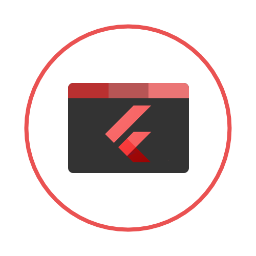

   

# NoneBot WebUI Mobile

_✨ NoneBot WebUI 的移动客户端 ✨_

 
<a href="https://webui.nbgui.top" target="__blank">
  <strong>📖 文档地址</strong>
</a>

## 📖 介绍

NoneBot WebUI 的移动客户端 

## 🖼️ 使用截图

    
    
    

## ⚙️安装

即刻前往：[Release](https://github.com/NonebotGUI/nonebot-webui-mobile/releases)

## 配置

[查看文档](https://webui.nbgui.top)

## 📄 许可

GPL-3.0 license

## 🐧 QQ Group

欢迎加入我们的 QQ 群组！

<a href="http://qm.qq.com/cgi-bin/qm/qr?_wv=1027&k=d5JPzIUg6qjJo3E0Zz9vBeUuYNTW3ooC&authKey=xm%2F53DWfXOoz7Is3Llbc9r9E%2FB7AkSV8ERCXf7hI3e%2Fb6ra5gEhoJIfiCzZz6rCz&noverify=0&group_code=972526136" target="__blank">
  <strong>972526136</strong>
</a>
